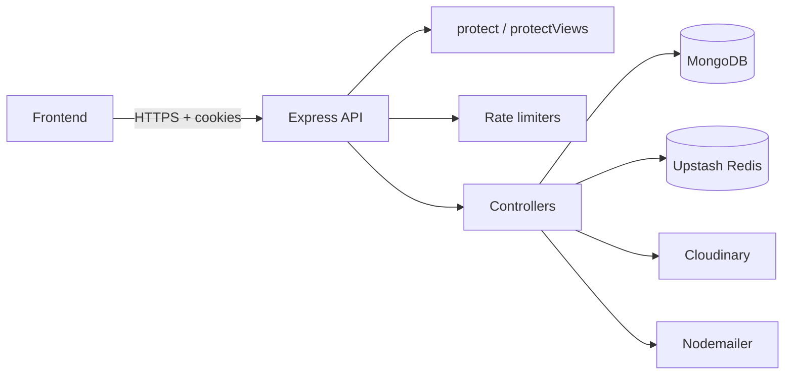

# Orbit — Project Documentation

A **social blogging platform API** (backend). Users sign up, publish posts with images, interact via likes/comments/follows/reposts/saves, and receive real-time-style **in-app notifications**. Built with **Node.js, Express, TypeScript, and MongoDB**.

> **Scope of this repo:** `backend/` only (REST API). Connect a separate frontend using `CLIENT_URL` + cookie auth.

---

## 1. Tech stack

| Technology                | Role                                                                 |
| ------------------------- | -------------------------------------------------------------------- |
| **Node.js + Express 5**   | HTTP server and routing                                              |
| **TypeScript**            | Type-safe backend code                                               |
| **MongoDB + Mongoose**    | Primary database and ODM                                             |
| **JWT (httpOnly cookie)** | Authentication (`jwt` cookie, 7-day expiry)                          |
| **Zod**                   | Request body validation (signup, login, posts, comments, passwords)  |
| **bcryptjs**              | Password hashing                                                     |
| **Cloudinary + Multer**   | Image upload (profile, banner, post images)                          |
| **Nodemailer (SMTP)**     | Welcome email, OTP, password-reset emails                            |
| **Upstash Redis**         | Response caching (feeds, comments, users, follows, saves)            |
| **express-rate-limit**    | Abuse protection on auth, OTP, comments, interactions, notifications |
| **Helmet**                | Security headers                                                     |
| **CORS**                  | Cross-origin access for frontend (`CLIENT_URL`, credentials)         |
| **slugify**               | Unique URL slugs for posts                                           |

---

## 2. Project structure

```
orbit/
└── backend/
    ├── src/
    │   ├── server.ts              # App entry, middleware, route mounting
    │   ├── configs/
    │   │   ├── env.ts             # Startup env validation (Zod)
    │   │   ├── cache.ts           # Redis get/set/clear helpers
    │   │   ├── redis.ts           # Upstash Redis client
    │   │   ├── cloudinary.ts      # Image CDN config
    │   │   ├── cookie.ts          # httpOnly cookie options
    │   │   ├── nodeMailer.ts      # Email sending helpers
    │   │   └── generateOtp.ts     # OTP generation
    │   ├── db/db.ts               # MongoDB connection
    │   ├── middlewares/
    │   │   ├── auth.middleware.ts       # protect — JWT from cookie
    │   │   ├── view.middleware.ts       # protectViews — optional auth for views
    │   │   ├── ratelimit.middleware.ts  # Rate limiters
    │   │   └── upload.middleware.ts     # Multer → Cloudinary
    │   ├── models/                # Mongoose schemas (8 models)
    │   ├── schemas/               # Zod validation (user, post, comment)
    │   ├── routes/                # Express routers (11 route files)
    │   ├── controllers/           # Business logic (11 controller files)
    │   └── utilities/
    │       └── notification.ts    # create/delete notification helpers
    ├── dist/                      # Compiled JS (npm run build)
    ├── .env                       # Secrets (not committed)
    └── package.json
```

---

## 3. Architecture overview



**Request flow:** Route → middleware (auth / rate limit / upload) → controller → model(s) → JSON response.  
**Side effects:** Notifications created on like, comment, follow, repost, save. Caches invalidated on writes.

---

## 4. Environment variables

Validated at startup in `configs/env.ts`. Server **exits** if any required value is missing or invalid.

| Variable                                                         | Purpose                                                                                   |
| ---------------------------------------------------------------- | ----------------------------------------------------------------------------------------- |
| `MONGO_URI`                                                      | MongoDB connection string                                                                 |
| `JWT_SECRET`                                                     | Sign/verify auth tokens                                                                   |
| `UPSTASH_REDIS_REST_URL`                                         | Redis cache URL                                                                           |
| `UPSTASH_REDIS_REST_TOKEN`                                       | Redis auth token                                                                          |
| `CLOUDINARY_NAME`, `CLOUDINARY_API_KEY`, `CLOUDINARY_API_SECRET` | Image storage                                                                             |
| `SMTP_HOST`, `SMTP_USER`, `SMTP_PASS`                            | Email delivery                                                                            |
| `CLIENT_URL`                                                     | Frontend origin for CORS and share links (must be full URL, e.g. `http://localhost:5173`) |
| `PORT`                                                           | Server port (default `5000`)                                                              |
| `NODE_ENV`                                                       | `development` / `production` / `test`                                                     |

---

## 5. How to run

```bash
cd backend
npm install
# Fill .env with all variables above
npm run dev      # Development (tsx watch)
npm run build    # Compile TypeScript → dist/
npm start        # Production (node dist/server.js)
```

**Frontend requests:** Use `credentials: "include"` so the `jwt` cookie is sent.

---

## 6. Security and hardening

- **Auth:** JWT in `httpOnly` cookie; `secure` in production; `sameSite: strict`
- **CORS:** Only `CLIENT_URL` allowed; `credentials: true`
- **Helmet:** Default security headers + `crossOriginResourcePolicy: cross-origin`
- **Body limit:** JSON capped at `100kb`
- **Rate limits:** See section 8
- **Ownership checks:** Update/delete post/comment; delete account requires password

---

## 7. Database models

| Model            | File                    | Purpose                                                                                        |
| ---------------- | ----------------------- | ---------------------------------------------------------------------------------------------- |
| **User**         | `user.model.ts`         | Account, profile, counts (`followersCount`, `followingCount`), password hash                   |
| **Post**         | `post.model.ts`         | Title, slug, content, image, author, counters (likes, comments, reposts, saves, shares, views) |
| **Comment**      | `comment.model.ts`      | Content, author, post, optional `parent` (replies), `likesCount`                               |
| **Like**         | `like.model.ts`         | User liked a **post** or **comment** (mutually exclusive per document)                         |
| **Follow**       | `follow.model.ts`       | `follower` → `following` relationship                                                          |
| **Repost**       | `repost.model.ts`       | User reposted a post                                                                           |
| **Save**         | `saves.model.ts`        | User saved a post                                                                              |
| **Notification** | `notification.model.ts` | In-app alerts (see types below)                                                                |

### Notification types

`like` | `comment` | `follow` | `repost` | `save`

- Stored with `recipient`, `sender`, optional `post` / `comment`, `isRead`
- Self-actions skipped (`sender === recipient`)
- Reply comments notify post author + parent comment author (deduplicated)

### Cascade deletes & notification cleanup

| Action                                    | What gets removed                                                                                              |
| ----------------------------------------- | -------------------------------------------------------------------------------------------------------------- |
| **deleteComment**                         | Comment tree, likes on those comments, notifications for those comments                                        |
| **deletePost**                            | Post, all comments, likes (post + comments), reposts, saves, notifications (post + comments), Cloudinary image |
| **Unlike / unfollow / unrepost / unsave** | Matching interaction notification via `deleteInteractionNotification()`                                        |

---

## 8. Middleware reference

| Middleware                        | Use                                                                |
| --------------------------------- | ------------------------------------------------------------------ |
| `protect`                         | Requires valid `jwt` cookie; sets `req.user`                       |
| `protectViews`                    | Optional auth — attaches user if logged in, still allows anonymous |
| `authLimiter`                     | 5 / 15 min — login, signup, password update                        |
| `otpLimiter`                      | 3 / 10 min — forgot-password OTP                                   |
| `commentLimiter`                  | 20 / min — add/update comment                                      |
| `interactionLimiter`              | 100 / min — likes, follows, reposts, saves, shares, views          |
| `notificationLimiter`             | 60 / min — read notifications                                      |
| `upload.single` / `upload.fields` | Multipart → Cloudinary                                             |

---

## 9. Caching (Redis)

| Cache key pattern                    | Used by             |
| ------------------------------------ | ------------------- |
| `posts:*`                            | Post feed list      |
| `post:{postId}`                      | Single post         |
| `comments:{postId}:{cursor}:{limit}` | Comments on a post  |
| `users:*`                            | User directory list |
| `followers:{userId}:*`               | Followers list      |
| `following:{userId}:*`               | Following list      |
| `saves:{userId}:*`                   | Saved posts list    |

Cleared on relevant writes via `clearFeedCache`, `clearCommentsCache`, `clearFollowCache`, `clearSavesCache`, `clearAllSavesCache`, `deleteCache`.

---

## 10. API routes (base: `/api`)

Legend: **Auth** = `protect` required | **View** = `protectViews` (optional login) | **Public** = no auth

### Auth — `/api/auth`

| Method | Path      | Auth   | Description                                   |
| ------ | --------- | ------ | --------------------------------------------- |
| POST   | `/signup` | Public | Register (multipart `profilePic` required)    |
| POST   | `/login`  | Public | Login; sets `jwt` cookie; clears stale cookie |
| POST   | `/logout` | Auth   | Clears `jwt` cookie                           |

### Password — `/api/password`

| Method | Path                          | Auth   | Description                        |
| ------ | ----------------------------- | ------ | ---------------------------------- |
| POST   | `/request-otp`                | Public | Send OTP email for forgot password |
| POST   | `/verify-and-forgot-password` | Public | Verify OTP and reset password      |
| POST   | `/update-password`            | Auth   | Change password while logged in    |

### Users — `/api/users`

| Method | Path               | Auth   | Description                                              |
| ------ | ------------------ | ------ | -------------------------------------------------------- |
| GET    | `/`                | Public | Paginated list of users (cached)                         |
| PUT    | `/update-profile`  | Auth   | Update profile/bio; optional `profilePic`, `bannerImage` |
| DELETE | `/delete-account/` | Auth   | Delete account (password + Cloudinary cleanup)           |
| POST   | `/:userId/share`   | Auth   | Increment share count; returns profile share URL         |
| POST   | `/:userId/view`    | View   | Increment profile view count                             |

### Posts — `/api/posts`

| Method | Path             | Auth   | Description                          |
| ------ | ---------------- | ------ | ------------------------------------ |
| GET    | `/`              | Public | Paginated feed (`?limit`, `?cursor`) |
| GET    | `/:postId`       | Public | Single post by ID                    |
| POST   | `/`              | Auth   | Create post (multipart `image`)      |
| PUT    | `/:postId`       | Auth   | Update own post                      |
| DELETE | `/:postId`       | Auth   | Delete own post (+ cascade)          |
| POST   | `/:postId/share` | Auth   | Share post; returns post URL         |
| POST   | `/:postId/view`  | View   | Increment post view count            |

### Comments — `/api/comments`

| Method | Path          | Auth   | Description                                           |
| ------ | ------------- | ------ | ----------------------------------------------------- |
| GET    | `/:postId`    | Public | Top-level comments + pagination (`?limit`, `?cursor`) |
| POST   | `/:postId`    | Auth   | Add comment or reply (`parent` optional)              |
| PUT    | `/:commentId` | Auth   | Edit own comment                                      |
| DELETE | `/:commentId` | Auth   | Delete own comment thread (+ cascade)                 |

### Likes — `/api/likes`

| Method | Path                  | Auth | Description            |
| ------ | --------------------- | ---- | ---------------------- |
| POST   | `/post/:postId`       | Auth | Toggle like on post    |
| POST   | `/comment/:commentId` | Auth | Toggle like on comment |

### Follows — `/api/follows`

| Method | Path                 | Auth   | Description                |
| ------ | -------------------- | ------ | -------------------------- |
| POST   | `/:userId`           | Auth   | Toggle follow/unfollow     |
| GET    | `/:userId/followers` | Public | Followers list (paginated) |
| GET    | `/:userId/following` | Public | Following list (paginated) |

### Saves — `/api/saves`

| Method | Path       | Auth | Description                               |
| ------ | ---------- | ---- | ----------------------------------------- |
| POST   | `/:postId` | Auth | Toggle save; notifies post author on save |
| GET    | `/`        | Auth | Current user's saved posts                |

### Reposts — `/api/reposts`

| Method | Path       | Auth | Description                            |
| ------ | ---------- | ---- | -------------------------------------- |
| POST   | `/:postId` | Auth | Toggle repost (cannot repost own post) |

### Search — `/api/search`

| Method | Path        | Auth | Description            |
| ------ | ----------- | ---- | ---------------------- |
| GET    | `/users?q=` | Auth | Search users by text   |
| GET    | `/posts?q=` | Auth | Full-text search posts |

### Notifications — `/api/notifications`

| Method | Path            | Auth | Description                              |
| ------ | --------------- | ---- | ---------------------------------------- |
| GET    | `/unread-count` | Auth | Count of unread notifications            |
| GET    | `/`             | Auth | List notifications (`?limit`, `?cursor`) |
| PUT    | `/mark-as-read` | Auth | Mark all notifications as read           |

**Notification pagination cursor:** `{timestamp}_{notificationId}` (not raw `_id`).

---

## 11. Controllers reference

| File                          | Exported functions                                                                            |
| ----------------------------- | --------------------------------------------------------------------------------------------- |
| `auth.controllers.ts`         | `signup`, `login`, `logout`                                                                   |
| `password.controllers.ts`     | `updatePassword`, `requestOtpForForgotPassword`, `verifyOtpAndForgotPassword`                 |
| `user.controllers.ts`         | `getAll`, `deleteAccount`, `shareProfile`, `viewsCount`, `updateProfile`                      |
| `post.controllers.ts`         | `getPost`, `getAllPosts`, `createPost`, `updatePost`, `deletePost`, `sharePost`, `viewsCount` |
| `comment.controllers.ts`      | `getComment`, `addComment`, `updateComment`, `deleteComment`                                  |
| `like.controllers.ts`         | `togglePostLikes`, `toggleCommentLikes`                                                       |
| `follow.controllers.ts`       | `toggleFollowUser`, `getFollowers`, `getFollowing`                                            |
| `saves.controllers.ts`        | `toggleSavePost`, `getSavedPosts`                                                             |
| `repost.controllers.ts`       | `toggleRepost`                                                                                |
| `search.controllers.ts`       | `searchUsers`, `searchPosts`                                                                  |
| `notification.controllers.ts` | `getUnreadCount`, `getNotifications`, `markAsRead`                                            |

**Utilities:** `utilities/notification.ts`

- `createNotification({ recipient, sender, type, post?, comment? })` — on like, comment, follow, repost, save
- `deleteInteractionNotification({ recipient, sender, type, post?, comment? })` — on unlike, unfollow, unrepost, unsave (use `comment: null` for post likes)

---

## 12. Validation schemas (Zod)

| File                        | Schemas                                                 |
| --------------------------- | ------------------------------------------------------- |
| `schemas/user.schema.ts`    | `signupSchema`, `loginSchema`, profile/password helpers |
| `schemas/post.schema.ts`    | `createPostSchema`, `updatePostSchema`                  |
| `schemas/comment.schema.ts` | `addCommentSchema`, `updateCommentSchema`               |

---

## 13. Feature summary (for presentation)

1. **User accounts** — Registration with profile photo, login/logout, profile updates, account deletion
2. **Posts** — CRUD with images, unique slugs, feed pagination, view/share counters
3. **Comments** — Threaded replies, edit/delete with cascade cleanup
4. **Social engagement** — Likes (posts & comments), follows, reposts, saves
5. **Notifications** — Automatic alerts for social actions; unread count; mark all read
6. **Search** — Users and posts (MongoDB text index on posts)
7. **Password recovery** — Email OTP flow
8. **Performance** — Redis caching on read-heavy endpoints
9. **Security** — Helmet, CORS, rate limits, env validation, cookie-based JWT

---

## 14. Common response patterns

- **Success:** `{ success: true, message, ...data }`
- **Client errors (4xx):** Often `{ success: false, message }`
- **Server errors (500):** `{ message: "Internal server error!" }` (no `success: false`)
- **Pagination:** `nextCursor`, `hasMore`, `limit` query params (max limits enforced per endpoint)

---

## 15. Known limitations (v1)

- No automated test suite
- Denormalized counters (likesCount, etc.) are not transactional — rare drift under heavy concurrency
- Cache invalidation uses `redis.keys()` — fine for small/medium scale

---

## 16. Continuing development — quick checklist

- [ ] Add frontend repo or document its API client base URL
- [ ] Fix `CLIENT_URL` in `.env` if server fails at boot
- [ ] Handle notification `type: "save"` in UI
- [ ] Use compound notification cursor for infinite scroll
- [ ] Consider adding health route `GET /api/health`
- [ ] Add integration tests (e.g. Vitest + supertest)

---

21 May 2026 | @indieDev | Panchajanya
